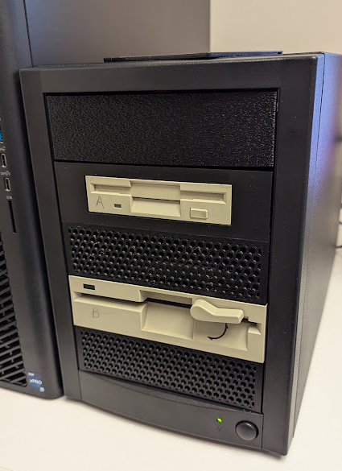

# FloppyDiskReader
Hardware and Software for the BDPL Floppy Disk Reader

## Hardware

The parts needed to build a reader from scratch are detailed in 
[Bill Of Materials](docs/bill_of_materials.md) and as of 2025 the cost is as little as $215 
using existing drives or $310 when buying eBay drives.

Assembly is described [here](docs/assembly.md)

## Software

The software is a Python / Qt application described [here](docs/software.md) 
and should run on most unix-y platforms, and maybe Windows (untested)

## License
Unless otherwise specified, all files are Copyright 2025 Trustees of Indiana 
University and are licensed under the Apache 2.0 License.

