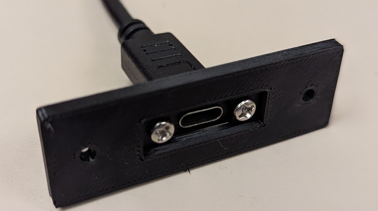
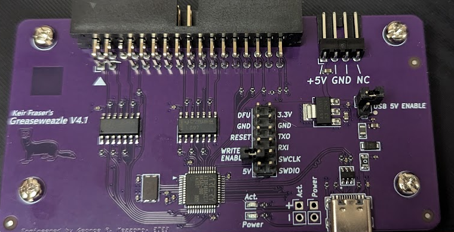
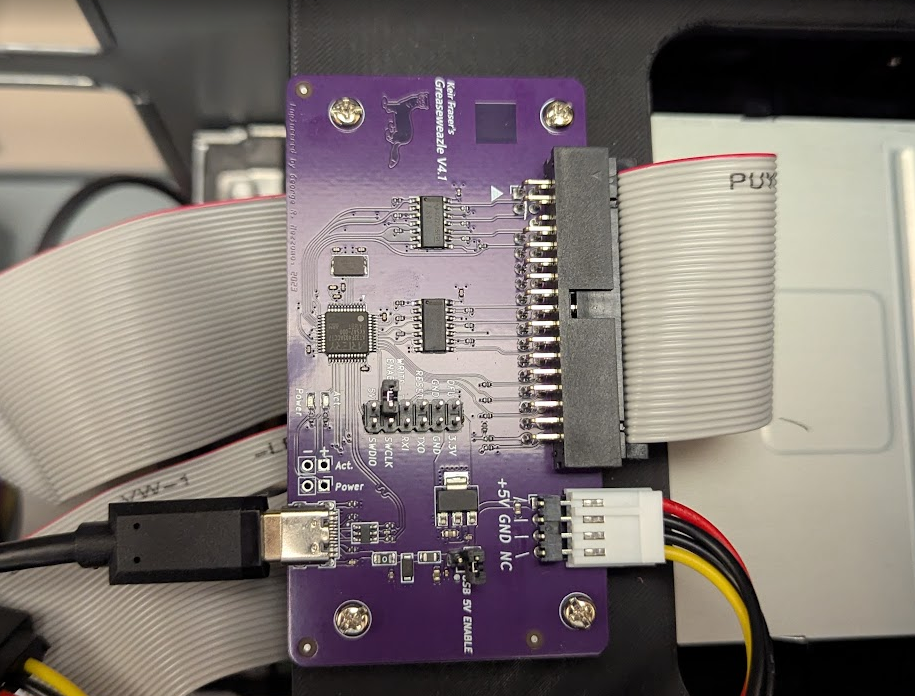

# Assembly

### Disk Drives

Mount the disk drives in the enclosure in a way that is most convenient.  If you have 
two disk drives you will likely want to put drive A above drive B.  The drive letter is 
assigned based on where it is connected to the cable.  The single connector after the 
twist on the data cable will be drive A and the one between the twist and the 
connector at the end of the cable will be drive B. 

It may make sense to install the data cable on the drives temporarily to help determine
the best organization for the drives.

Each drive installed will need both a power cable and a data cable.

The power cables will only fit in one orientation.  You may need power adapters
to get the correct connectors for your enclosure and drives.

Some data cables do not have notches to force a specific orientation so make 
sure pin 1 is connected correctly.

On the cable pin 1 is usually indicated by a red stripe on the edge of the 
ribbon.

On the disk drive pin 1 is usually indicated by a triangle/arrow or a 1.  If 
pin 34 is indicated on the drive then pin 1 is on the other end.

If any data cables are inserted upside down the device will not work and when
powered on the drive lights will stay on.

### USB Bulkhead

A USB extension cable is connected to a bulkhead adapter and then the adapter
is mounted to the case.

### Greaseweazle

Two jumpers will need to be changed to configure the Greaseweazle:
* USB 5V ENABLE - this will allow the device to be powered by the enclosure
* WRITE-ENABLE - this will block writes to the floppy drives

In both of these cases the jumpers need to be removed.  Optionally, instead of removing
the jumpers they can be placed at a 90 degree angle and connected to only one pin.

The greaseweazle will be mounted to the 3d-printed tray using whatever screws from the PC
kit that are convenient.  The tray itself will be mounted into the enclosure the same way
the drives were.

Three cables will need to be connected to the greaseweazle:  usb, power, and
data.

The USB port on the greaseweazle will be connected to the extension cable from
the bulkhead connector.  If the cable is too short then the longer greaseweazle
tray may be needed.

The power cable will only fit one way and depending on the enclosure you may
need some adapters to get the right plug.

As with the floppy drives, the data cable should be oriented so pin 1 on the
cable is aligned with pin 1 on the greaseweazle.  On the greaseweazle, pin 1
is indicated by an arrow on the circuit board and on the connector itself.

### Drive Blanks
Any left over drive bays can have drive blanks mounted.

