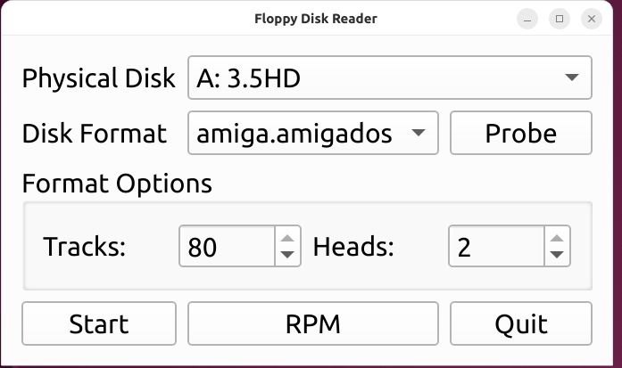
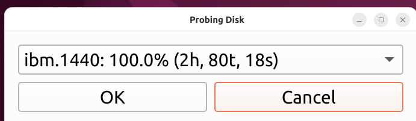
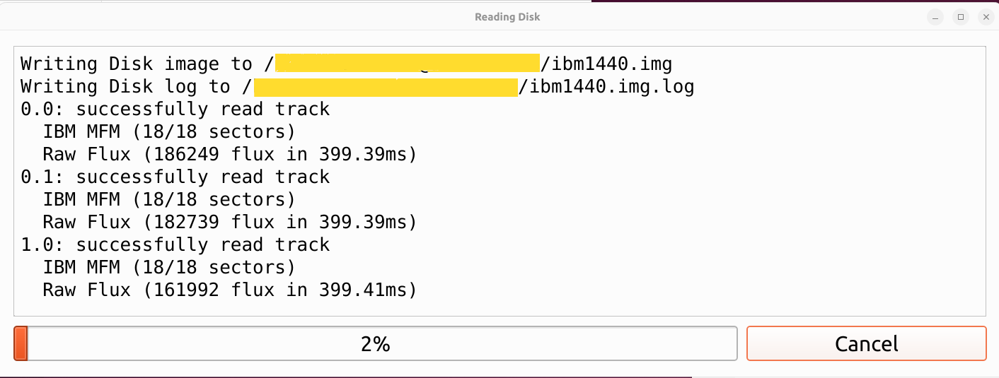

# Software

## Installation

Installation for this software should be pretty straightforward: it's a python
application running in a virtual environment.  It's been tested on Python 3.10
and 3.13

In the directory create the virtual environment and install the dependencies:

```
python3 -m venv .venv
. .venv/bin/activate
pip install -r requirements.txt
```

If successful, then the application can be started by running the `FloppyDiskReader`
shell script.

## Hardware Setup

Connect the floppy reader hardware to your computer using a USB cable.  When
the reader is powered on it will show up as a USB device called `generic greaseweazle`

You can verify this by running `lsusb`.


## Configuring the software

Copy the `FloppyDiskReader.conf.sample` file to `FloppyDiskReader.conf`.  That
is a basic configuration and should work in most cases where Drive A is a 3.5" 
HD floppy drive and B is a 5.25" HD drive.  

If necessary modify the configuration to meet your needs.  The file format is
YAML so aligning with spaces is important.

Linux permisions may block access to the greaseweazle.  To grant permission to
a user, become root and add them to the `dialout` group.  The user will need to
log out and log back in for the group changes to take effect.

## Running the software

The software can be started by running FloppyDiskReader.  If it is able to 
connect to the greaseweazle it will display the main window:



The controls are:
* Physical disk selects which drive should be used for the read
* Disk format dropdown indicates what format should be read
* Probe button will try to determine the type of disk installed in the physical disk
* Format options allow control of number of tracks and number of heads
* Start button will start a new disk read
* RPM will test the RPM of the selected disk drive 
* Quit exits the program.

### Testing Disk RPM
Normally this isn't needed but it is a good way to verify the greaseweazle is
operating correctly.  Place a disk in the drive and hit the RPM button.  

If things are working it will show the expected RPM and the actual spin rate.


### Probing the format
Sometimes it's impossible to know what kind of disk you have.  The disk probe
will read track 1 of all of the configured format types and show you the ones
that it thinks are applicable.  The most likely candidate is the default:



The percentage shown is the amount of expected sectors it was able to read. 
This number may be less than 100% if the disk has errors.

Some formats may be indistinguisable from each other.  For example, when probing
a 360K PC floppy (9 sectors per track), if the rare 320K (8 sectors per track)
floppy format is added to the list of formats to probe both will show 100%, 
but internally when using the 320K format it'll complain that it found an extra
sector on the track that was ignored.  The list is sorted by largest format
first, so that will likely be the correct format if there is ambiguity.

Select OK to use that format, cancel to manually select.

NOTE:  This is the physical format on the disk - the configuration of the
magnetic flux.  Macintosh 1.44M floppies will show up as `ibm.1440` because
the physical format is the same as the IBM 1.44M format even though the filesystem
data on there is different (HFS vs FAT16)

### Format Options
Normally this will not be needed unless you are wanting to read a partial disk.

One notable exception to this is for the `commodore.1541` format.  The format
allows for 40 tracks but the normal format was 35.  When reading these disks
one would adjust it down to 35 tracks.


### Reading a disk
Once the drive and format are selected and any adjustments are made to the format,
then pressing the Start button will read the disk.

A file dialog will allow you to choose where to save the disk image and the 
extension should be automatically selected.  Once selected, a read window
will pop up:



This is a running log of the disk read and will be stored in a file that has 
the same name as the disk image with `.log` appended to it.

#### Read errors
If there are any read errors the track will be retried and if it still fails
the bad sector will be filled with the text `-=[BAD SECTOR]=-` to maintain
alignment.

The log will note that there were read failures at the end to alert the operator

